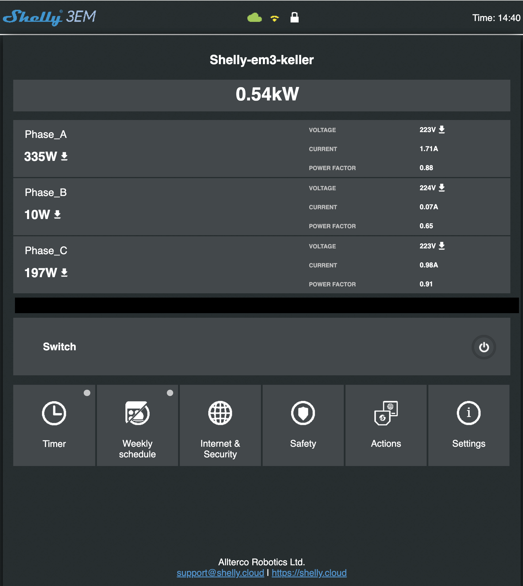
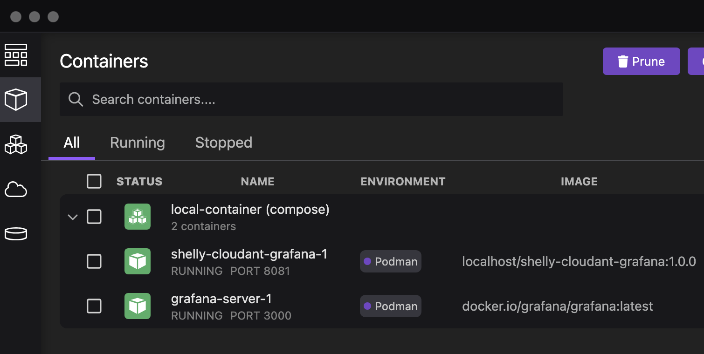
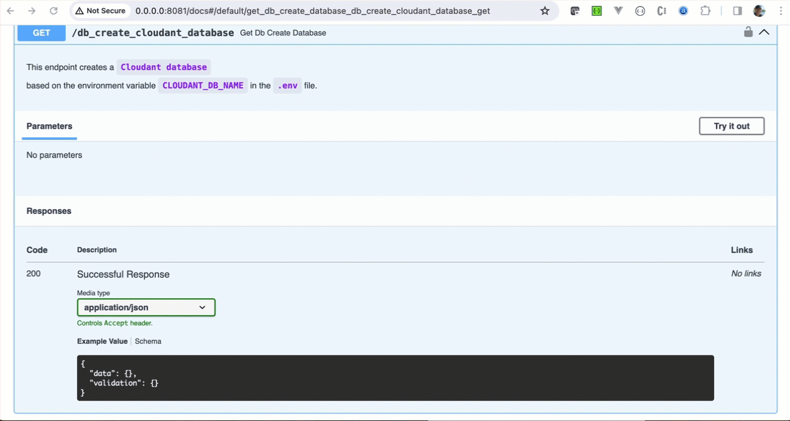
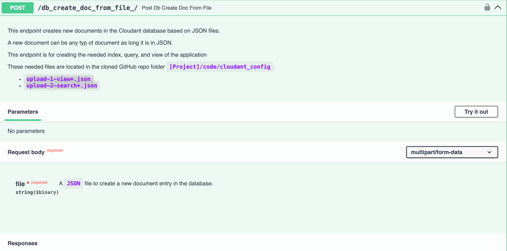
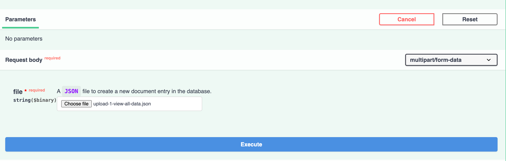
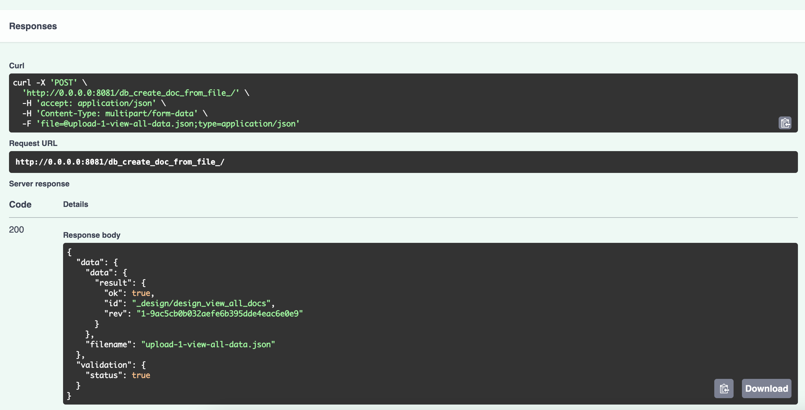
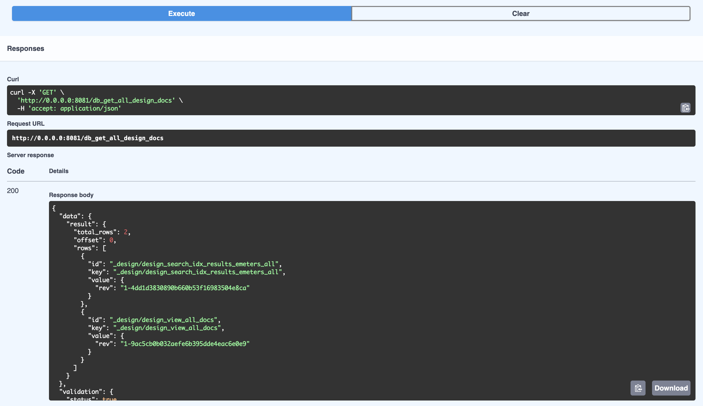
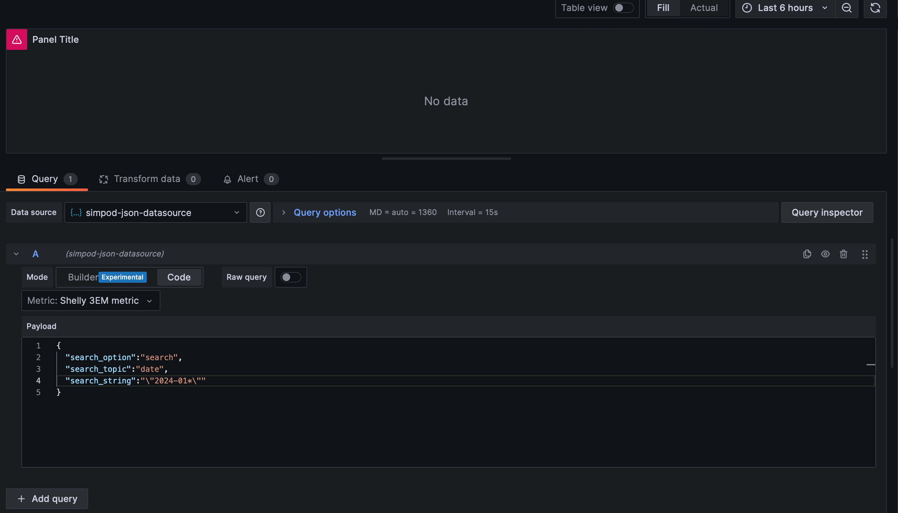
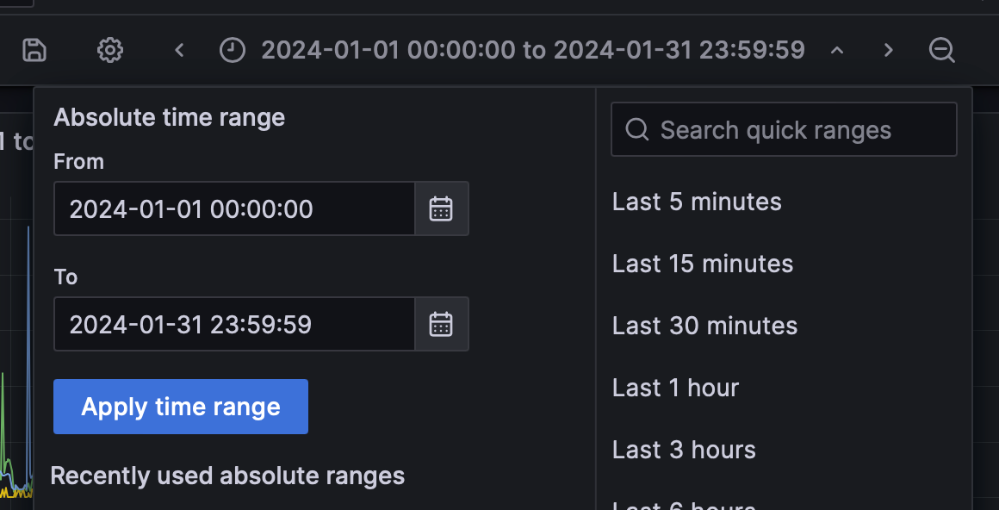

# Define your custom visualization for `Shelly 3EM` with `Grafana`

_How to build a connection server for `Shelly 3EM`, `IBM Cloud Cloudant`, and `Grafana`?_

`Balcony power plants` are trendy, and of course, if you have one, you want to have more detailed information about your current electricity consumption and what you have saved. An easy way is to use Shelly3EM to get this data.

The main objective of this project is to explain how to implement an example using the [`Shelly 3EM`](https://shelly-api-docs.shelly.cloud/gen1/#shelly-3em), [`IBM Cloud Cloudant`](https://cloud.ibm.com/apidocs/cloudant#introduction), and [Grafana](https://grafana.com/) dashboard to perform custom visualization and store historical data for better insights. The project provides detailed information on the architecture, motivation, components, used technologies, setup for various environments, and the step-by-step procedure to configure and run the example using Podman Compose. It also includes instructions for setting up authentication for Grafana and configuring a new dashboard for visualizing the data.

Therefore, the `Shelly 3EM Cloudant Grafana connection server` implements an API using FastAPI in Python. The API provides functionality to interact with and manage data in a Cloudant database, retrieve IBM Cloud configuration information, and schedule tasks to save Shelly data. 

The gif below shows an example configuration for a new custom dashboard.


The image below shows a simplified architecture.


The following picture displays an instance of a running project in the `Raspberry Pi`, `Shelly`, `IBM Cloudant Database`, `shelly-3em-cloudant-grafana -connection-server`, `Grafana` configuration.


The following gif shows the running project in action.


**Table of Content**

1. [Motivation and main objective](#1-motivation-and-main-objective)
2. [Levels of knowledge to run the example](#2-levels-of-knowledge-to-run-the-example)
3. [Architectural overview](#3-architectural-overview)
4. [Environments](#4-environments)
5. [Used technologies and APIs](#5-used-technologies-and-apis)
6. [Prerequisites for each environment of the Example](#6-prerequisites-for-each-environment-of-the-example)
7. [Setup of the Example in the `Podman compose` environment](#7-setup-of-the-example-in-the-podman-compose-environment)

## 1. Motivation and main objective

The motivation for the project is learning, creating custom visualization, and saving money.

The [`Shelly 3EM`](https://shelly.com) _" is a WiFi smart 3-phase energy meter with contactor control with three independent measuring channels up to 120 A each, contactor control (or load up to 10 A)"_.

[Shelly](https://shelly.com) provides a [Cloud subscription](https://kb.shelly.cloud/knowledge-base/premium-service) in combination with the mobile app called `Shelly Smart Control` you have enormous options for `real-time` monitoring and managing activations.

Therefore GitHub repository contains an example to implement a Shelly 3EM-Cloudant-Grafana-connection-s contains the implements for a **`Shelly 3EM`-`Cloudant`-`Grafana`-connection-server**. The implementation doesn't have the objective of monitoring `real-time` data of the `Shelly 3EM`. 

The main objective is to save historical data hourly in the size of `0,375 kb` in a [`JSON`](https://en.wikipedia.org/wiki/JSON) format for one Shelly data object to reduce storage for the free tier in the `lite plan` of an [`IBM Cloud Cloudant database`](https://cloud.ibm.com/catalog/services/cloudant).
The visualization of historical hourly data is done by using `Grafana`. To display the historical data, we can create incredible custom dashboards with the `Open-Source` version of [`Grafana`](https://grafana.com/oss/grafana/).

These are the components used in this project:

* Grafana provides a huge capability to visualize data and is also available as [Open-Source](https://grafana.com/oss/grafana/) for running as a container or an application.
  * The [`Grafana Json Datasource`](https://github.com/simPod/GrafanaJsonDatasource) is used to customize the `IBM Cloud Cloudant Database` access. This usage is to avoid the usage of `enterprise plugins` for Grafana in this project. The project does implement the `OpenAPI` specification for the [`simPod JSON`](https://grafana.com/grafana/plugins/simpod-json-datasource/) to realize a basic `data source connector` that can access the Cloudant database on IBM Cloud.
* `Shelly 3EM` provides a free API to connect to your device and collect data.
* `IBM Cloud Cloudant` _"is a fully managed, distributed database optimized for heavy workloads and fast-growing web and mobile apps, IBM® Cloudant® is available as an IBM Cloud® service with a 99.99% SLA. Cloudant elastically scales throughput and storage, and its API and replication protocols are compatible with Apache CouchDB for _hybrid or _multi-cloud_ architectures._"_ and provides a [lite plan](https://cloud.ibm.com/catalog/services/cloudant) for the usage of the database for development. ( at the moment for storage `1GB`) 

The **`Shelly 3EM`-`Cloudant`-`Grafana`-connection-server** should run in three environments:

* `Raspberry Pi 3`
* `Containerized` in `Podman compose` on a local machine
* `IBM Cloud Code Engine` in combination with `Raspberry Pi 3`

## 2. Levels of knowledge to run the example

The following levels of knowledge can be helpful when you run the example: 

* Programming language Python: `beginner to intermediate`
* Query definition of NoSQL databases: `beginner`
* Raspberry Pi: `beginner`
* Containerization: `beginner to intermediate`
* Grafana: `beginner`
* Network and remote access: `beginner`
* IBM Cloud: `beginner`
* IBM Cloudant: `beginner`
* Shelly 3EM: `beginner`
* Bash scripting: `beginner`
* Linux OS/macOS commands: `beginner`

## 3. Architectural overview

The following diagram shows the simplified dependencies of the basic architecture of the `Shelly 3EM Cloudant Grafana connection server` that implements an API using FastAPI in Python. The API provides functionality to interact with and manage data in a Cloudant database, retrieve IBM Cloud configuration information, and schedule tasks to save Shelly data. It also includes endpoints related to Grafana integration for defining metrics, returning metrics payload options, and selecting queries. The code also sets up basic authentication and custom logging configurations.


Main modules of the **`Shelly 3EM`-`Cloudant`-`Grafana`-connection-server**

* Cloudant connection module
  
  The main objective of this module is to interact with the IBM Cloud Cloudant service using REST API calls to perform various operations such as retrieving information about service instances, databases, indexes, documents, and views and searching for data. The code also handles the authentication and token management required for accessing the Cloudant service. The functions in the module handle different API calls and error handling to ensure smooth interaction with the Cloudant service. The module uses the [IBM Cloud `IAM authentication`](https://cloud.ibm.com/docs/account?topic=account-iamoverview) to access the database.

* Grafana connection module
  
  The module implements the needed endpoints for the [`Grafana JSON Datasource`](https://github.com/simPod/GrafanaJsonDatasource) integration to retrieve, format, and return data from a Cloudant database for integration with Grafana. The module defines functions to convert and retrieve specific data from preset search queries and views and to handle and format empty datasets if needed. Additionally, the module provides options for configuring and selecting different data sources and metrics for use in Grafana. The module also includes logging configuration based on a specified log level.

* Shelly connection module
  
  The module implements how to get the consumption data, which will be saved in the Cloudant database; therefore, the module retrieves power consumption data from a Shelly device using REST API calls and authentication. The module includes functions to fetch overall consumption data and data for specific phases. It handles authentication, constructs the necessary headers, and validates the response from the API. The module also sets up logging based on the provided configuration. Overall, the module focuses on interacting with the Shelly device API to retrieve power consumption data.

* IBM Cloud connection module

  The module implements how to get an [IAM authentication token from IBM Cloud](https://cloud.ibm.com/docs/account?topic=account-userapikey&interface=ui). The module configures logging, loads IBM cloud environment variables and API keys, and then uses that information to make a POST request to the IBM cloud identity token endpoint to retrieve an access token. The module also handles the response from the token request and returns the access token and its verification status.

* Data format for the Shelly data

  ```json
  {
    "_id": "03e3f5f27e8742aea0035ff4bf0dd3ee",
    "_rev": "1-1c8c94efab24a8da925978234e7e4ce6",
    "result": {
      "emeters": [
        {
          "power": 178.08,
          "pf": 0.72,
          "current": 1.11,
          "voltage": 225.86,
          "is_valid": true,
          "total": 60608,
          "total_returned": 320.9
        },
        {
          "power": 4.71,
          "pf": 0.53,
          "current": 0.04,
          "voltage": 226.14,
          "is_valid": true,
          "total": 32062.3,
          "total_returned": 0
        },
        {
          "power": 195.98,
          "pf": 0.93,
          "current": 0.95,
          "voltage": 225.08,
          "is_valid": true,
          "total": 51733.8,
          "total_returned": 0
        }
      ],
      "date": "2025-12-25 21:41:50",
      "total_power": 378.77
    }
  }
  ```
   
Here is a basic flow of the **`Shelly 3EM`-`Cloudant`-`Grafana`-connection-server** usage:

    1. Get data from `Shelly 3EM`
    2. Save data in a `Cloudant` database
    3. Display data in `Grafana`

## 4. Environments

This section is a basic overview of the environments, their components, and their implementation status.

0. For all environments:

    * `Shelly 3EM`
    * `IBM Cloud Cloudant database`
    * Grafana data source [JSON](https://grafana.com/grafana/plugins/simpod-json-datasource/)

1. `Raspberry Pi 3` status **(done)**:

    * RAM: `1G`
    * Python3: Version `3.9`
    * Local applications: 
      * `Shelly Cloudant Grafana` server application
      * Grafana server `v10.2.3`
      
      Simplified architecture overview:

      

    Detailed information related to the setup is in the following additional readmes:
    1. [The Grafana setup on `Raspberry-Pi`](./code/rasppi/README-grafana.md)
    2. [The setup of the `Shelly-Cloudant-Grafana-connection-server` on `Raspberry Pi`](./code/rasppi/README-shelly-cloudant-grafana.md)
    3. [The setup of a `Raspberry Pi`](./code/rasppi/README.md)
    4. [The setup of a `Cloudant database`](./code/cloudant_config/README.md)

2. `Podman compose` status **(done)**:

    * Containers: 
      * `Shelly Cloudant Grafana` server application
      * Grafana server `v10.2.3`

      Simplified architecture overview:

      

    **Note:** Detailed information related to the setup is in this section _5. Setup of the Example in the `Podman compose` _environment"_ in this document.

3. `IBM Cloud Code Engine` and `Raspberry Pi 3` status **(done)**:
    
    * `Raspberry Pi 3`
    * [IBM Cloud Code Engine](https://www.ibm.com/products/code-engine)
      * Container including: 
        * `Shelly Cloudant Grafana` server application
        * Grafana server `v10.2.3`
    * [IBM Cloud Container Registry](https://www.ibm.com/products/container-registry)
      
      Simplified architecture overview:
      
      

    Detailed information related to the setup is in the following additional readmes:
    1. [The Grafana setup on `Raspberry-Pi`](./code/rasppi/README-grafana.md)
    2. [The setup of the `Shelly-Cloudant-Grafana-connection-server` on `Raspberry Pi`](./code/rasppi/README-shelly-cloudant-grafana.md)
    3. [The setup of a `Raspberry Pi`](./code/rasppi/README.md)
    4. [The setup of a `Cloudant database`](./code/cloudant_config/README.md)
    5. [Automation of the IBM Cloud Code Engine deployment](./scripts/ce-deployment/README.md)

## 5. Used technologies and APIs

These are the used technologies and APIs.

* Programming language: `Python`
* Python runtime: `3.9` or higher
* Server framework: [FastAPI](https://fastapi.tiangolo.com/)
* Container runtime: [`Podman`](https://podman.io/) and [Podman compose](https://github.com/containers/podman-compose)
* APIs: 
  * [Shelly API](https://shelly-api-docs.shelly.cloud/gen1/#shelly-3em)
  * [IBM Cloud Cloudant API](https://cloud.ibm.com/apidocs/cloudant)
  * Implementation of `Open API` definition for [`Grafana JSON Datasource`](https://github.com/simPod/GrafanaJsonDatasource)

## 6. Prerequisites for each environment of the Example

We need to know the configuration data for `Shelly 3EM`, `IBM Cloud`, `Cloudant`, and the `WLAN router`. The image below shows the simplified dependencies for the `Podman compose` environment.


* Containers running in `Podman compose`
  * `Shelly Cloudant Grafana` server application
  * Grafana server

6.1 [Get `Shelly 3EM` configuration](#61-get-shelly-3em-configuration)
6.2 [Setup of the `IBM Cloud Cloudant` service](#62-setup-of-the-ibm-cloud-cloudant-service)
  
### 6.1 Get `Shelly 3EM` configuration

* `WLAN IP` address of the `Shelly 3EM`



* Restrict access to your `Shelly 3EM`


* Get the `Shelly 3EM ID`


The following values will be later saved in an environment variables file.

```sh
export SHELLY_URL=http://192.168.133.1
export SHELLY_USER=admin
export SHELLY_PASSWORD=admin
export SHELLY_ID=XXX
```

### 6.2 Setup of the `IBM Cloud Cloudant` service

1. Create an [IBM Cloud Cloudant service](https://cloud.ibm.com/catalog/services/cloudant) and ensure you select `Lite` as your plan option for the example usage.
2. Create new [IBM Cloud Cloudant service credentials](https://cloud.ibm.com/docs/Cloudant?topic=Cloudant-locating-your-service-credentials) as `Manager`

      You can inspect the details about the authentication in the [IBM Cloud documentation](https://cloud.ibm.com/docs/Cloudant?topic=Cloudant-managing-access-for-cloudant#ibm-cloudant-api-keys-and-use-only-iam_ai)

3. [Create an `IBM Cloud API key`](https://cloud.ibm.com/docs/account?topic=account-userapikey&interface=ui)

The following values will be later saved in an environment variables file.

```sh
# IBM Cloudant
export CLOUDANT_URL="https://XXX.cloudantnosqldb.appdomain.cloud"
export CLOUDANT_DB_NAME=shelly-3em-data
# IBM Cloud
export IBMCLOUD_APIKEY=XXX
export IBMCLOUD_URL=https://iam.cloud.ibm.com/identity/token
```

4. The creation of the `database`, `view`, and `query index` in the IBM Cloud Cloudant service will be done in section _7.3 Run `Grafana` and `shelly3em-cloudant-grafana-connection-server` with "Podman compose"_.

**Note:** Details are in this project's [IBM Cloud Cloudant configuration `README`](./code/cloudant_config/README.md).

## 7. Setup of the Example in the `Podman compose` environment

The `Podman compose` environment is the best to start and verify how the integration works. You can easily run it on your computer.

**Prerequisites overview**

Ensure you have:

1. .. [Python 3.9](https://www.python.org/downloads/release/python-390/) or higher installed on your machine.
2. ... (Optional) [Setup a virtual environment for Python](https://suedbroecker.net/2023/05/23/set-a-virtual-environment-for-python/)
3. ... the Shelly configuration information.
4. ... an IBM Cloud account.
5. ... an IBM Cloud Cloudant service instance.

**Setup content overview**

1. [Get the source code and create a virtual Python environment](#71-get-the-source-code-and-create-a-virtual-python-environment)
2. [`(Optional)` Run the server locally first](#72-optional-run-the-server-locally-first)
3. [Run `Grafana` and `shelly3em-cloudant-grafana-connection-server` with "Podman compose"](#73-run-grafana-and-shelly3em-cloudant-grafana-connection-server-with-podman-compose)
4. [Create and configure the Cloudant database](#74-create-and-configure-the-cloudant-database)
5. [Start the schedule to save Shelly data](#75-start-the-schedule-to-save-shelly-data)
6. [Configure Grafana and create a custom dashboard](#76-configure-grafana-and-create-a-dashboard)

### 7.1. Get the source code and create a virtual Python environment

#### Step 1: Clone the project

```sh
git clone https://github.com/thomassuedbroecker/shelly-cloudant-grafana.git
```

#### Step 2: Create an environment file from the template

```sh
cd code
cat .env-environment > .env
```

#### Step 3:  Insert the needed values

```sh
# Shelly 3EM
export SHELLY_URL=http://192.168.133.1
export SHELLY_USER=admin
export SHELLY_PASSWORD=admin
export SHELLY_ID=XXX
# IBM Cloudant
export CLOUDANT_URL="https://XXX.cloudantnosqldb.appdomain.cloud"
export CLOUDANT_DB_NAME=shelly-3em-data
# IBM Cloud
export IBMCLOUD_APIKEY=XXX
export IBMCLOUD_URL=https://iam.cloud.ibm.com/identity/token
# APP
export APP_USER=adm
export APP_APIKEY=admin
# Options are DEBUG, INFO, and WARNING
export APP_LOG=DEBUG 
# Grafana
export GF_SECURITY_ADMIN_USER=admin
export GF_SECURITY_ADMIN_PASSWORD=admin
export GF_INSTALL_PLUGINS=simpod-json-datasource 
```

### 7.2 `(Optional)` Run the server locally first

We get the source code and verify if the application is running locally.

#### Step 1: Create a virtual Python environment

```sh
cd shelly-cloudant-grafana/code
python3.11 -m venv shelly-cloudant-grafana-env-3.11
source shelly-cloudant-grafana-env-3.11/bin/activate
```

#### Step 2: Install the needed Python libs and create a `requirements.txt` file

* Option 1:

```sh
python3 -m pip install --upgrade pip
python3 -m pip install "fastapi[all]"
python3 -m pip install fastapi-utils
python3 -m pip install schedule
python3 -m pip install requests
python3 -m pip install pydantic
python3 -m pip install typing
python3 -m pip install --upgrade "ibmcloudant>=0.0.27"
python3 -m pip freeze > requirements.txt 
```

* Option 2:

```sh
python3 -m pip install --upgrade pip
python3 -m pip install -r requirements.txt
```

#### Step 3: Run `shelly-3em-cloudant-connector` server

```sh
cd code
source source shelly-cloudant-grafana-env-3.11/bin/activate
source .env
python3 shelly-3em-cloudant-connector.py
```

## 7.3 Run `Grafana` and `shelly3em-cloudant-grafana-connection-server` with "Podman compose"

We need to ensure that the `Cloudant database` exists and that the search index and the view have been created by you so that the Grafana integration is working. The configuration of the Cloudant database can be set up by you with the `shelly3em-cloudant-grafana-connection-server` running in "Podman compose". 

**Note:** Verify all environment variables are set in the `.env` file.

In `Podman compose`, we run `Grafana` and `shelly3em-cloudant-grafana-connection-server` servers and these are the main three topics of interest in this environment.

1. The `Podman compose` environment is for simple development and builds `shelly3em-cloudant-grafana-connection-server` each time when compose is started.

2. The `Grafana` server depends on a successful start of the `shelly3em-cloudant-grafana-connection-server`.

3. Later, we connect the `Grafana server` to `shelly3em-cloudant-grafana-connection-server` inside the `Podman compose` network `https://shelly-cloudant-grafana:8081` therefore we need to configure the Cloudant database.

Here is the content of the file to configure `Podman compose`:

```yaml
version: "2.15.1"
services:
  shelly-cloudant-grafana:
    build: 
      context: ${PODMAN_CONTEXT}
      dockerfile: ${PODMAN_CONTEXT}/docker/Dockerfile
    image: shelly-cloudant-grafana:1.0.0
    container_name: shelly-cloudant-grafana
    ports:
      - 8081:8081
    environment:
      - SHELLY_URL=${SHELLY_URL}
      - SHELLY_USER=${SHELLY_USER}
      - SHELLY_PASSWORD=${SHELLY_PASSWORD}
      - SHELLY_ID=${SHELLY_ID}
      - CLOUDANT_URL=${CLOUDANT_URL}
      - CLOUDANT_DB_NAME=${CLOUDANT_DB_NAME}
      - IBMCLOUD_APIKEY=${IBMCLOUD_APIKEY}
      - IBMCLOUD_URL=${IBMCLOUD_URL}
      - APP_USER=${APP_USER}
      - APP_APIKEY=${APP_APIKEY}
      - APP_LOG=${APP_LOG}
  grafana-server:
    image: docker.io/grafana/grafana:latest
    container_name: grafana
    environment:
      - GF_SECURITY_ADMIN_USER=${GF_SECURITY_ADMIN_USER}
      - GF_SECURITY_ADMIN_PASSWORD=${GF_SECURITY_ADMIN_PASSWORD}
      - GF_INSTALL_PLUGINS==${GF_INSTALL_PLUGINS}
    ports:
      - 3000:3000
    links:
    - shelly-cloudant-grafana
    depends_on:
    - shelly-cloudant-grafana 
```

The following steps will guide setting up the needed environment on a `macOS`.

### Step 1: Install the container runtime `podman-desktop`

Install the container runtime [podman-desktop](https://podman-desktop.io/downloads/macos).
An example installation with [`brew`](https://formulae.brew.sh/) on macOS is here.

```sh
brew install --cask podman-desktop
```

The image below shows the running `podman-desktop` on a local machine.


### Step 2: Install [`podman-compose`](https://github.com/containers/podman-compose)

The `podman-compose` installation runs with Python.

```sh
python3 -m pip install --upgrade pip
python3 -m pip install podman-compose
```

Verify installation:

```sh
podman-compose --help
```

### Step 3: Start the containers locally using `Podman compose`

1. Start `Podman compose` with the bash script `start-containers.sh`

The script verifies that `Podman` runs and loads the needed environment variables.

```sh
cd scripts/local-container
sh start-containers.sh
```

The image below shows the `Podman compose` running the container in the `Podman Desktop` application.



### 7.4 Create and configure the Cloudant database

### Step 1: Create the database in the IBM Cloud Cloudant service

The database name is defined in the environment variable `export CLOUDANT_DB_NAME=shelly-3em-data` in the `.env` file.

1. Open the `shelly-cloudant-grafana` server
    ```sh
    open http://0.0.0.0:8081/docs
    ```
2. This has opened a browser `Swagger UI` of the `shelly-cloudant-grafana` server. In this UI select the endpoint: `db_create_cloudant_database`
3. Press `Try it out`
4. Press `Execute`

The gif below shows the steps.



### Step 2: Create the needed `view` and `query index` in the database

Now, we must create a `view` and `query index` in the database. Therefore, the documents are in the folder `code/cloudant_config` of the cloned GitHub project.
These kinds of documents are called `design documents`.

1. Select in the `Swagger UI` the endpoint `db_create_doc_from_file`
2. Press `Try it out`
   
3. Select the file with the document to upload: `upload-1-view-all-data.json`, `upload-2-search_index_all_data_javascipt.json`
   
4. Press `Execute`
5. Verify if the document was created 
correctly. After the execution, you can see in the `Response` that the template file was used correctly to create a document in the database.

   

### Step 3: Verify the created design documents

To verify the created design documents.

1. Select in the `Swagger UI` the endpoint `db_get_all_design_docs`
2. Press `Try it out`
3. Press `Execute`
4. Verify
   

### 7.5 Start the schedule to save Shelly data

### Step 1: Start the schedule to save the Shelly data frequently.

The schedule is `hard coded` to save the Shelly data hourly.

!**Don't wait for a response**! See notes.

1. Select in the `Swagger UI` the endpoint `schedule_start`
2. Press `Try it out`
3. Press `Execute`
4. !**Don't wait for a response**! See notes.
   
5. Verify the schedule is running by selecting in the `Swagger UI` the endpoint `schedule_get_status`

**Note:** Using the Overload functionality for functions in Python for the function schedule_start. There are better ways to implement a job schedule; the implementation will be changed in future versions. You can find details in the https://www.scaler.com/topics/function-overloading-in-python/ blog post.

## 7.6 Configure Grafana and create a dashboard

### Step 1: Configure authentication for `Grafana`

This section depends on variables configured in the environment variables for the `Grafana` container.

_Note:_ You can find examples of the environment variables in the [`Grafana.ini`] file(https://github.com/grafana/grafana/blob/main/conf/defaults.ini).

1. Open `Grafana` in a browser

  ```sh
  open http://localhost:3000
  ```

2. Login 

  User: `admin`
  Password: `admin123`

3. Update password

### Step 2: Add the `JSON` data source

Add the [`simPod JSON`](https://grafana.com/grafana/plugins/simpod-json-datasource/) as a `data source`.

_Note:_ To avoid the usage of `enterprise plugins` for Grafana in this project. The project does implement the `OpenAPI` specification` for the [`simPod JSON`](https://grafana.com/grafana/plugins/simpod-json-datasource/) to realize a primary `data source connector` that can access the Cloudant database on IBM Cloud.

[GitHub project with the `OpenAPI specification`](https://github.com/simPod/GrafanaJsonDatasource/blob/0.6.x/openapi.yaml)


### Step 3: Configure the `data source`

Now we connect our 

* URL: `http://shelly-cloudant-grafana:8081`
* USER: `adm`
* PASSWORD: `admin`


### Step 4: `Save and test` the connection


### Step 5: Add a new `dashboard`

1. Select `New dashboard`


2. Press `add Visualization` 


3. Select `simpod-json-datasource` 


4. Select `Shelly 3EM Metrics` 


5. Insert a payload configuration

Here, you can configure `search_option` with `search` or `view`.
If you select "search" you can specify topics like `date` and add a search string for the Cloudant search.

The following payload will provide all the Shelly data from the date `2024-01`.

```json
{
  "search_option":"search",
  "search_topic":"date",
  "search_string":"\"2024-01*\""
}
```



6. If you see that the `time field` is missing.


7. We need to map the field `time` of the return values from `type string` to the `type time`. Therefore, we are using the `Transform data` functionality of Grafana.


8. In `Transform data` we select `Convert field type`.


9. Now, we select the `time` field and choose time as `time` type. 

|   | |
|---|---|
|||


10. In this step, we configure the format.


_Note:_ If you don't see any values ensure your dashboard configuration time frame fits your return values.



## 8. Summary

Overall, it is incredible that Shelly3EM provides a documented REST API so that you can implement custom solutions. 

This example solution shows many setup options to use an IBM Cloud Cloudant Database to save the historical data for your Shelly data and access your custom visualization from your local network or the internet with minimal cost. 

With that example, you can keep informed about your power consumption and what you return to your power provider generated by your `Balcony power plant`.

The Grafana UI usage is excellent in local computer browsers or on a mobile browser. 

Feel free to implement your configuration or add additional options for other databases or runtimes.