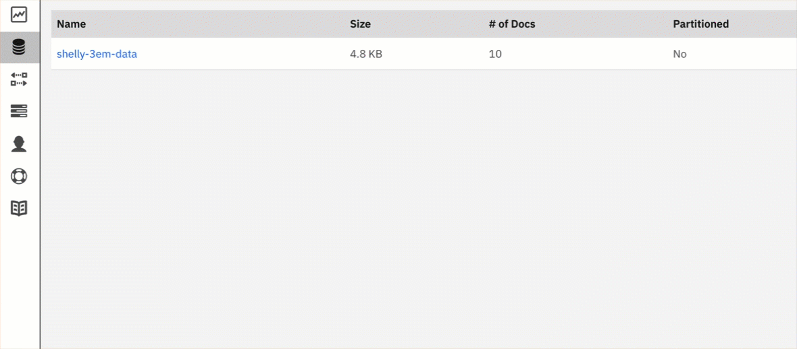
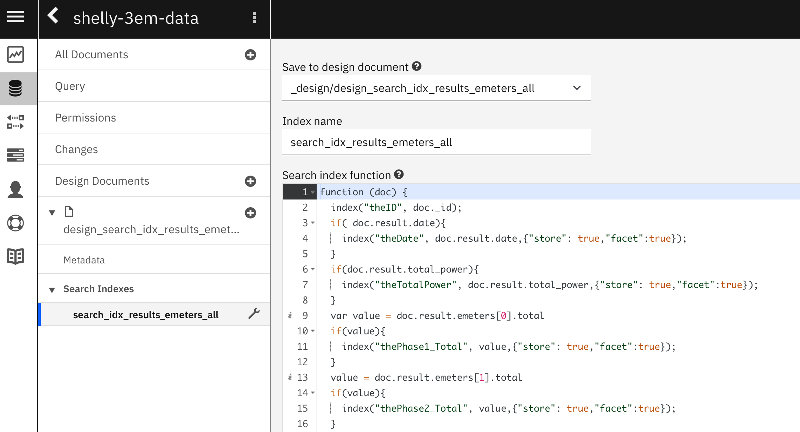
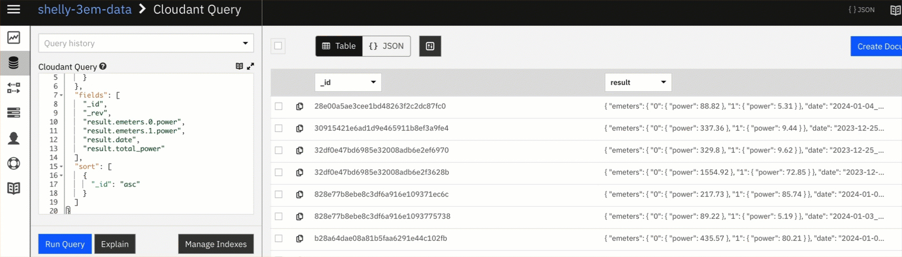
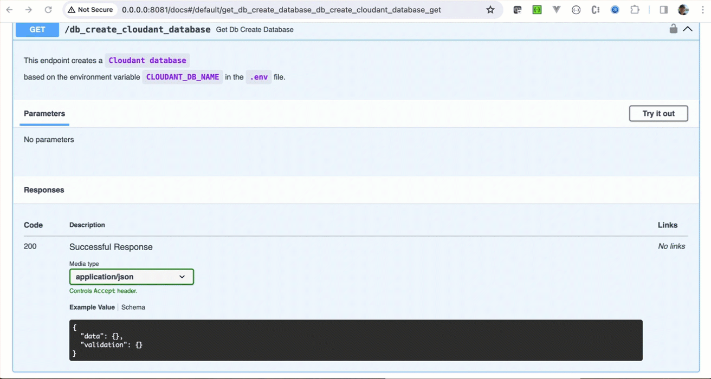
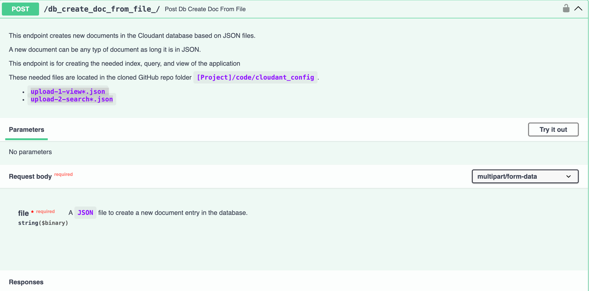
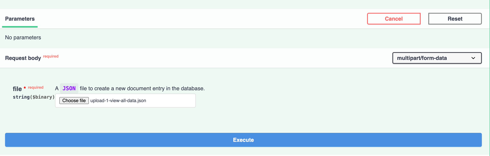
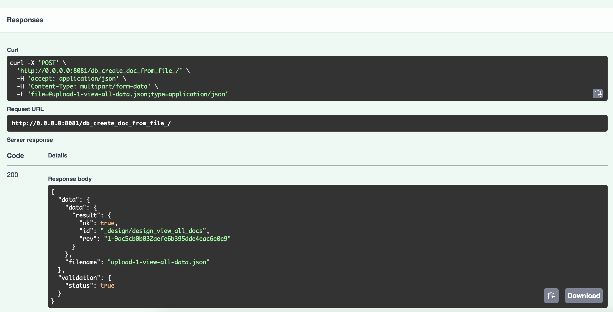
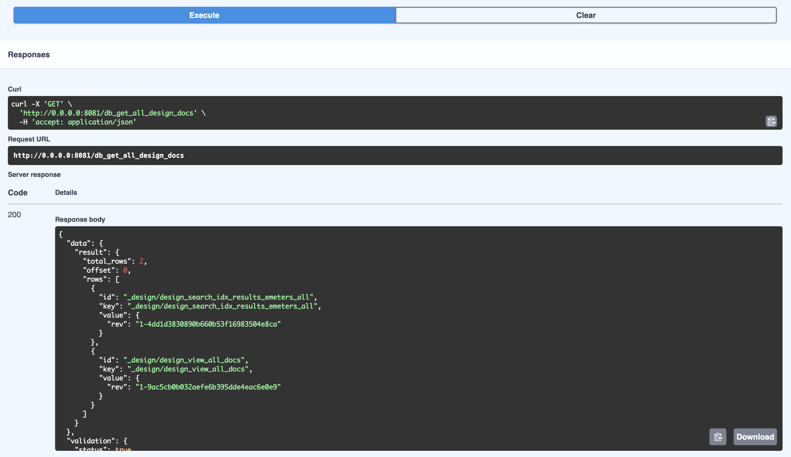

# Configure the Cloudant Database

To query the data from the database, you need to configure the Cloudant database.
Therefore, we must set up an index, view, and search index.

**Note:** For more details, visit the [IBM Cloud Cloudant documentation](https://cloud.ibm.com/docs/Cloudant)

The data format for the Shelly data saved in the database is essential, and this is an example of a data entry.

```json
{
  "_id": "03e3f5f27e8742aea0035ff4bf0dd3ee",
  "_rev": "1-1c8c94efab24a8da925978234e7e4ce6",
  "result": {
    "emeters": [
      {
        "power": 178.08,
        "pf": 0.72,
        "current": 1.11,
        "voltage": 225.86,
        "is_valid": true,
        "total": 60608,
        "total_returned": 320.9
      },
      {
        "power": 4.71,
        "pf": 0.53,
        "current": 0.04,
        "voltage": 226.14,
        "is_valid": true,
        "total": 32062.3,
        "total_returned": 0
      },
      {
        "power": 195.98,
        "pf": 0.93,
        "current": 0.95,
        "voltage": 225.08,
        "is_valid": true,
        "total": 51733.8,
        "total_returned": 0
      }
    ],
    "date": "2024-01-08 21:41:50",
    "total_power": 378.77
  }
}
```

## Examples for searches and indexes

## 1. Cloudant `Search query index` 

The `gif` below shows an example usage of a [`search query`](https://cloud.ibm.com/docs/Cloudant?topic=Cloudant-cloudant-search).
Search examples: `
1. `total_power:[1000 TO 2000`
2. `date:2024*`
3. `total_power:{2000 TO Infinity]`
4. `(total_power:{2000 TO Infinity]) AND  (date:"2024-01*")`

Example for the payload in the Grafana query

```sh
{
   "search_option":"custom",
   "search_topic":"date",
   "search_string":"(phase1_power:[-5000 TO 0])"
}
```

You can find more detailed information related to queries with Lucene in the [Lucene Apache Documentation](https://lucene.apache.org/core/4_3_0/queryparser/org/apache/lucene/queryparser/classic/package-summary.html#Overview)



* Example `search query` definition in the Cloudant UI:



* Example of a function definition for a `Search query index` using JavaScript

```javascript
function (doc) {
  index("_id", doc._id);
  if( doc.result.date){
    index("date", doc.result.date,{"store": true,"facet":true});
  }
  if(doc.result.total_power){
    index("total_power", doc.result.total_power,{"store": true,"facet":true});
  }
  var value = doc.result.emeters[0].total
  if(value){
    index("phase1_total", value,{"store": true,"facet":true});
  }
  value = doc.result.emeters[1].total
  if(value){
    index("phase2_total", value,{"store": true,"facet":true});
  }
  value = doc.result.emeters[2].total
  if(value){
    index("phase3_total", value,{"store": true,"facet":true});
  }
  value = doc.result.emeters[0].total_returned
  if(value){
    index("phase1_total_returned", value,{"store": true,"facet":true});
  } else {
    index("phase1_total_returned", 0 ,{"store": true,"facet":true});
  }
  value = doc.result.emeters[1].total_returned
  if(value){
    index("phase2_total_returned", value,{"store": true,"facet":true});
  } else {
    index("phase2_total_returned", 0 ,{"store": true,"facet":true});
  }
  value = doc.result.emeters[2].total_returned
  if(value){
    index("phase3_total_returned", value,{"store": true,"facet":true});
  } else {
    index("phase3_total_returned", 0 ,{"store": true,"facet":true});
  }
  value = doc.result.emeters[0].power
  if(value){
    index("phase1_power", value,{"store": true,"facet":true});
  }
  value = doc.result.emeters[1].power
  if(doc.result.emeters[1].power){
    index("phase2_power", doc.result.emeters[1].power,{"store": true,"facet":true});
  }
  value = doc.result.emeters[2].power
  if(value){
    index("phase3_power", value,{"store": true,"facet":true});
  }
}
```

* Example return value format:

```json
{
  "id": "828e77b8ebe8c3df6a916e1093775738",
  "order": [
    0.75,
    0
  ],
  "fields": {
    "phase3_power": 86.11,
    "total_power": 180.52,
    "phase2_total": 18946.3,
    "phase3_total_returned": 0,
    "phase3_total": 29507.8,
    "date": "2023-12-25 10:43:08",
    "phase1_total_returned": 271.5,
    "phase1_total": 36261.8,
    "phase1_power": 89.22,
    "phase2_power": 5.19,
    "phase2_total_returned": 0
  }
}
```

## 2. Cloudant query

The `gif` below shows an example usage of a [`Cloudant query`](https://cloud.ibm.com/docs/Cloudant?topic=Cloudant-cloudant-search).



* Example `Cloudant query`

```json
{
  "selector": {
    "_id": {
      "$gt": "0"
    }
  },
  "fields": [
    "_id",
    "_rev",
    "result.emeters.0.power",
    "result.emeters.1.power",
    "result.date",
    "result.total_power"
  ],
  "sort": [
    {
      "_id": "asc"
    }
  ]
}
```

## 3. Creation of the `database`, `view`, and `query index` in the IBM Cloud Cloudant service

### Step 1: Ensure the `shelly-cloudant-grafana-connection-server` is up and running
  
### Step 2: Create the database in the IBM Cloud Cloudant service

You can define the database name in the .env file.

1. Open the `shelly-cloudant-grafana` server
    ```sh
    open http://0.0.0.0:8081/docs
    ```
2. This has opened a browser `Swagger UI` of the `shelly-cloudant-grafana` server. In this UI select the  endpoint: `db_create_cloudant_database`
3. Press `Try it out`
4. Press `Execute`

The gif below shows the steps.



### Step 3: Create the needed `view` and `query index` in the database

To access the data later, we create a `view` and `query index` in the database. Therefore, the documents are in the folder `code/cloudant_config` of the cloned GitHub project.
These kinds of documents are called `design documents`.

1. Select in the `Swagger UI` the endpoint `db_create_doc_from_file`
2. Press `Try it out`

3. Select the file with the document to upload: `upload-1-view-all-data.json`, `upload-2-search_index_all_data_javascipt.json`

4. Press `Execute`
5. Verify that the document was created correctly inside the Cloudant database.
After the execution, you can see in the `Response` that the template file was used to create a document in the database.



### Step 4: Verify the created design documents

To verify the created design documents.

1. Select in the `Swagger UI` the endpoint `db_get_all_design_docs`
2. Press `Try it out`
3. Press `Execute`
4. Verify
   