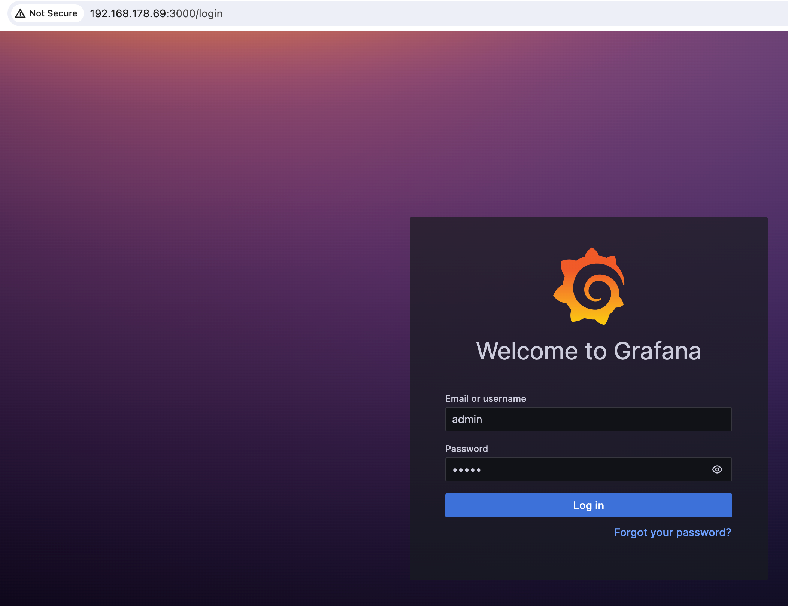
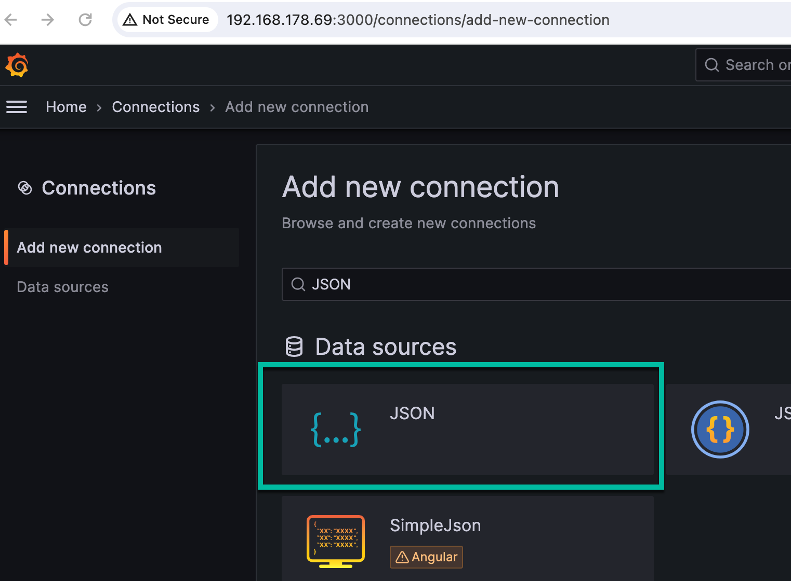
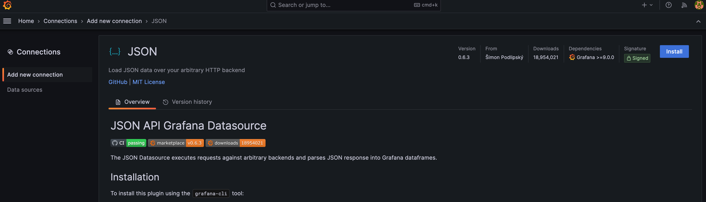

# [Grafana setup on `Raspberry-Pi`](https://grafana.com/tutorials/install-grafana-on-raspberry-pi/)

The main objective of this `README` is to provide a guide on setting up Grafana on a Raspberry Pi. It includes installation steps, server startup, configuration of Grafana, adding a connection for JSON, and configuring the Grafana.ini file.

1. [Installation](#1-installation)
2. [Grafana configuration](#2-grafana-configuration)

## 1. Installation

#### Step 0: Connect with `shh` remote connection from your local machine to the `Raspberry Pi`

```sh
export HOSTNAME=192.168.178.69
export REMOTE_USER=pi
ssh ${REMOTE_USER}@${HOSTNAME}
```

### Step 1: Follow the steps in the [Grafana documentation](https://grafana.com/tutorials/install-grafana-on-raspberry-pi/) to install Grafana on `Raspberry-Pi`

### Step 2: Extract how to start the server

```sh
sudo /bin/systemctl enable grafana-server
```

```sh
sudo /bin/systemctl start grafana-server
```

```sh
sudo shutdown -r now 
```

## 2. Grafana configuration

### Step 1: Open Grafana

```sh
export HOSTNAME=192.168.178.69
open http://${HOSTNAME}:3000
```

### Step 2: Change the password

Login with `admin`/`admin`.



### Step 3: Add a connection for `JSON`

Select `JSON`.



### Step 4: Select `install`



## 3. `Grafana.ini` configuration

Verify the `Grafana.ini` configuration to more options for an initial setup.
One important topic is the time format configuration.

```sh
sudo nano /etc/grafana/grafana.ini
```

* Data format for the `time`:

```sh
# For information on what formatting patterns that are supported https://momentjs.com/docs/#/displayi>

# Default system date format used in time range picker and other places where full time is displayed
;full_date = YYYY-MM-DD HH:mm:ss

# Used by graph and other places where we only show small intervals
;interval_second = HH:mm:ss
;interval_minute = HH:mm
;interval_hour = MM/DD HH:mm
;interval_day = MM/DD
;interval_month = YYYY-MM
;interval_year = YYYY
```

## 4. (`Optional`) Add `Raspberry Pi Monitoring`

You can follow the steps in this article [`Raspberry Pi Monitoring`](https://grafana.com/docs/grafana-cloud/monitor-infrastructure/integrations/integration-reference/integration-raspberry-pi-node/)
