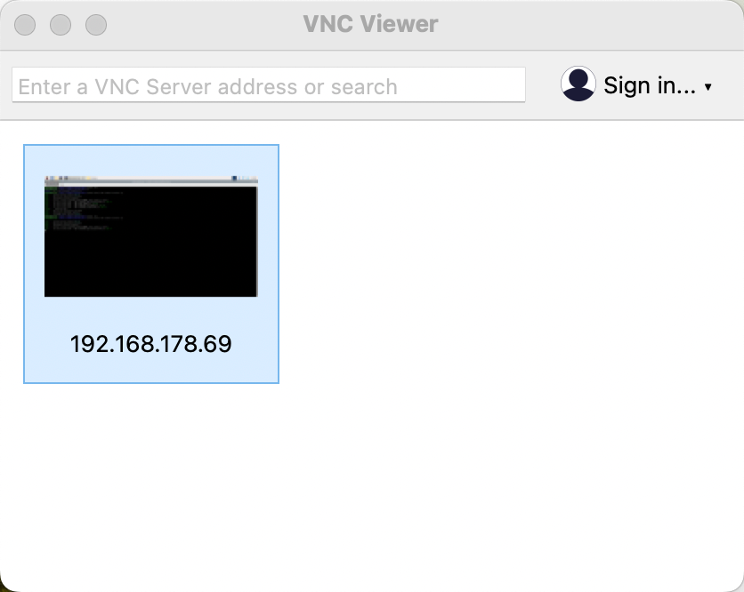

# The setup of the `Shelly-Cloudant-Grafana-connection-server` on `Raspberry Pi`

This `README` aims to provide a step-by-step guide for setting up the `Shelly-Cloudant-Grafana-connection-server` on a Raspberry Pi. It includes instructions for connecting to the Raspberry Pi, creating directories, installing required Python packages, copying files from the local computer to the Raspberry Pi, deleting unnecessary folders or files, and starting the application. Additionally, it provides optional instructions for copying only the relevant files to the Raspberry Pi.

The following steps do expect that you have cloned the project to your local computer.
We will only copy the needed files to the `Raspberry Pi` from the local computer.

Ensure Python 9 or higher runs on your `Raspberry Pi`, also ensure [`SSH`](https://en.wikipedia.org/wiki/Secure_Shell) and [`VNC`](https://de.wikipedia.org/wiki/Virtual_Network_Computing) are enabled on your `Raspberry Pi`.

## 1. Open the first terminal on your local computer

### Step 1: Connect in the `first terminal` to the `Raspberry Pi`

```sh
export HOSTNAME=192.168.178.69
export REMOTE_USER=pi
ssh ${REMOTE_USER}@${HOSTNAME}
```

## Step 2: Create a directory called  `shelly-cloudant-grafana`

Create a folder for the `shelly-cloudant-grafana-connection-server`.


```sh
mkdir /home/pi/shelly-cloudant-grafana
```

```sh
cd /home/pi/shelly-cloudant-grafana
```

## Step 3: Install the needed Python packages 

```sh
python3 -m pip install --upgrade pip
python3 -m pip install "fastapi[all]"
python3 -m pip install fastapi-utils
python3 -m pip install schedule
python3 -m pip install requests
python3 -m pip install pydantic
python3 -m pip install typing
python3 -m pip install --upgrade "ibmcloudant>=0.0.27"
python3 -m pip freeze > requirements.txt 
```

_Note:_ When you get this message: `"WARNING: The script normalizer is installed in '/home/pi/.local/bin' which is not on PATH."` you can execute the following commands.

```sh
export PATH="/home/pi/.local/bin:$PATH"
source ~/.bashrc
echo $PATH
```

## Step 3: Open a `second terminal` and navigate to your GitHub project `shelly-cloudant-grafana` root folder

```sh
pwd
/Users/---YOUR_PATH---/shelly-cloudant-grafana
```

## Step 4: Copy the `code/` folder to the `Raspberry Pi`

This will copy all files in the `code/` folder to the `Raspberry Pi`.
In `Step 5` we will delete the no needed one.

```sh
export HOSTNAME=192.168.178.69
export REMOTE_USER=pi
export DESTINATION_PATH=/home/pi/shelly-cloudant-grafana
scp -rp code/ ${REMOTE_USER}@${HOSTNAME}:${DESTINATION_PATH}
```

* Optional: Replacement of the needed files by copying only the relevant files to the `Raspberry Pi` :

```sh
cd code
export HOSTNAME=192.168.178.69
export REMOTE_USER=pi
export DESTINATION_PATH=/home/pi/shelly-cloudant-grafana/code
scp -rp shelly-3em-cloudant-connector.py ${REMOTE_USER}@${HOSTNAME}:${DESTINATION_PATH}
scp -rp modules/apis_payload.py ${REMOTE_USER}@${HOSTNAME}:${DESTINATION_PATH}/modules
scp -rp modules/apis_response_format.py ${REMOTE_USER}@${HOSTNAME}:${DESTINATION_PATH}/modules
scp -rp modules/load_env.py ${REMOTE_USER}@${HOSTNAME}:${DESTINATION_PATH}/modules
scp -rp modules/requests_cloudant.py ${REMOTE_USER}@${HOSTNAME}:${DESTINATION_PATH}/modules
scp -rp modules/requests_ibmcloud_token.py ${REMOTE_USER}@${HOSTNAME}:${DESTINATION_PATH}/modules
scp -rp modules/requests_json_grafana_datasource.py ${REMOTE_USER}@${HOSTNAME}:${DESTINATION_PATH}/modules
scp -rp modules/requests_shelly_3em.py ${REMOTE_USER}@${HOSTNAME}:${DESTINATION_PATH}/modules
```

## Step 5: Open the `first terminal` again to delete the not-needed folders or files

```sh
cd /home/pi/shelly-cloudant-grafana
rm -rf /home/pi/shelly-cloudant-grafana/code/shelly-cloudant-grafana-env-3.11
rm -rf /home/pi/shelly-cloudant-grafana/code/rasppi
rm -rf /home/pi/shelly-cloudant-grafana/code/docker
rm -rf /home/pi/shelly-cloudant-grafana/code/cloudant_config
rm -rf /home/pi/shelly-cloudant-grafana/code/modules/__pycache__
rm -rf /home/pi/shelly-cloudant-grafana/code/shelly-cloudant-grafana.code-workspace
rm -rf /home/pi/shelly-cloudant-grafana/code/requirements.txt
rm -rf /home/pi/shelly-cloudant-grafana/code/.DS_Store
ls -al
```

##  2. Access your `Raspberry Pi` with [`VNC`](https://www.realvnc.com/en/)

## Step 1: Open VNC




## Step 2: Open a `terminal``


## Step 3: Start the application this `terminal`

```sh
cd /home/pi/shelly-cloudant-grafana/code
source .env
python3 shelly-3em-cloudant-connector.py
```
