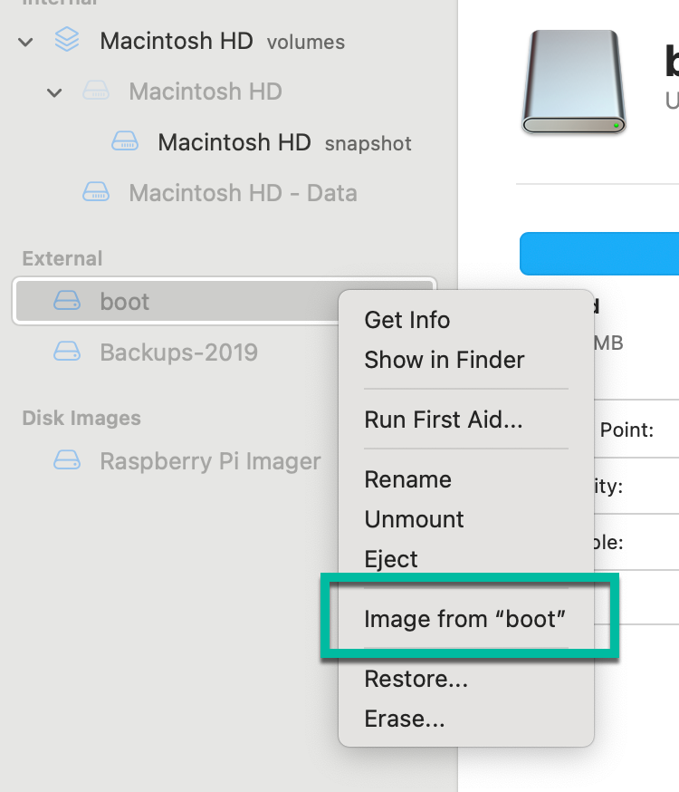

# The setup of a `Raspberry Pi`

The main objective of this `README` is to guide users on how to set up and Backup their Raspberry Pi devices using different methods such as creating a new Raspberry Pi image, backing up the image to an SD card, and backing up the image to an external disk using a macOS. It provides step-by-step instructions for each method, including enabling SSH access, finding the IP address, and creating an image from an SD card. Additionally, it also covers how to use the Raspberry Pi Imager to create a new Raspberry Pi image on a macOS."

1. [Backup your `Raspberry Pi` image to an `sd-card`](#1-backup-your-raspberry-pi-image-to-a-sd-card)
2. [Backup your `Raspberry Pi` image to an `external disk` with a `macOS`](#2-backup-your-raspberry-pi-image-to-an-external-disk-with-a-macos)
3. [Create a new `Raspberry Pi` image with `Raspberry Pi Imager` on `macOS`](#3-create-a-new-raspberry-pi-image-with-raspberry-pi-imager-on-macos)

## 1. Backup your `Raspberry Pi` image to a `sd-card`

### 1.1 Connect to your existing `Raspberry Pi` with `SSH`

#### Step 1: Ensure you set the `root password` of your `Raspberry Pi` 

```sh
sudo su
```

```sh
passwd
```

```sh
sudo passwd pi
```

* Optional:

```sh
reboot
```

#### Step 2: Enable the `ssh` access on your `Raspberry Pi` using the command line

Enter the following command:

```sh
sudo raspi-config
```

2. Select `Interfacing Options`

3. Select `SSH`

4. Enable `SSH`

5. Finish

#### Step 3: Get the `IP address` of your `Raspberry Pi` 

```sh
ifconfig
```

or

```sh
hostname -I
```

#### Step 4: Connect with `shh` remote connection from your local machine to the `Raspberry Pi`

```sh
export HOSTNAME=192.168.178.69
export REMOTE_USER=pi
ssh ${REMOTE_USER}@${HOSTNAME}
```

### 1.2 Add an `SD card`

### 1.3 Save the data to the external storage

#### Step 1: Find the source of the current configuration `mmcblk0`

```sh
cd /dev
ls | grep mmcblk0
```

#### Step 2: Find the source of the current configuration

```sh
sudo dd bs=4M if=/dev/mmcblk0 of=/dev/sda
```

## 2. Backup your `Raspberry Pi` image to an `external disk` with a `macOS`

### Step 1: Insert to your computer the `Raspberry Pi - SD card` and an external disk to 

### Step 2: Open `Disk Utility`


### Step 3: Create an image from `SD Card` as `DVD/CD master`



### Step 4: Rename the created file from `crd` to `iso`


## 3. Create a new Raspberry Pi image with [Raspberry Pi Imager](https://www.raspberrypi.com/software/) on `macOS`

### Step 1: Download [Raspberry Pi Imager](https://www.raspberrypi.com/software/) to the local machine

### Step 2: Select the `Operating System` to install


### Step 3: Configure the `Operating System` settings

* Enable `ssh` and `VNC` for remote connection inside your `WLAN`.


### Step 3: Save


### Step 4: Finish


